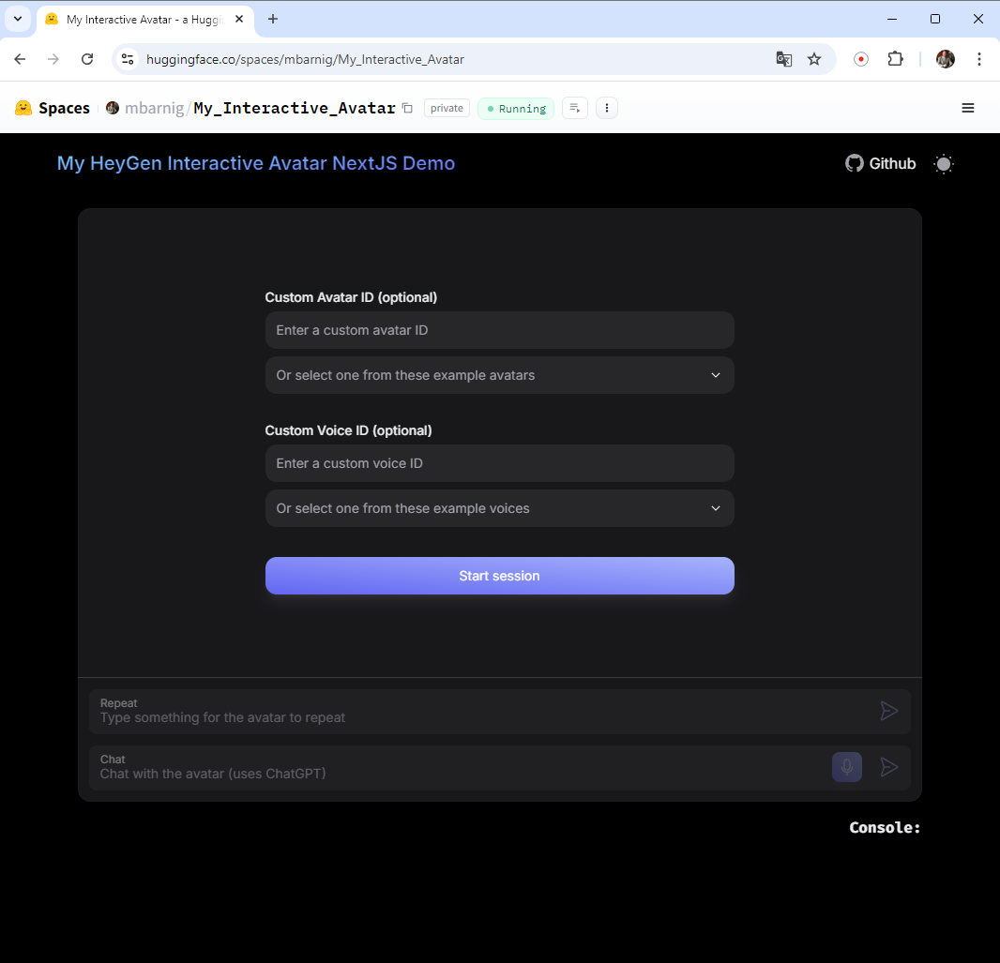
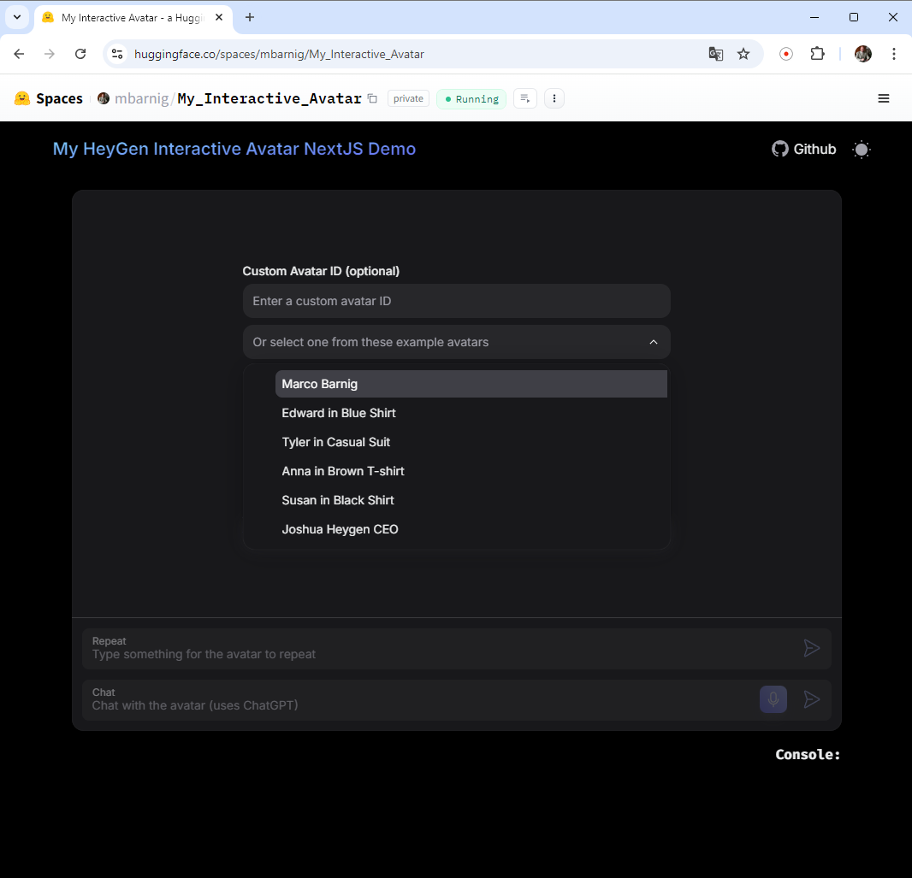

# HeyGen Interactive Avatar NextJS Demo

This repo is a fork of the official HeyGen Interactive Avatar Demo.

I did the following modifications :    
### /package.json
I added the prefix "PORT=7860" to the scripts dev, build and start 
### /app/lib/constants.ts
I added the avatar_id "Marco Barnig" and the voice_ids "Marco Barnig" and "Marcos_digital_twin" to the selection list of available avatars and voices. 
To do : add preview mp3 files of the voices.
### /app/page.tsx
I deleted the tabs "demo / code".
### /components/NavBar.tsx
I changed the header text and deleted the links Avatars, Voices, API Docs, Guide and and replaced SDK with the link of this Github repo.
### /components/InteractiveAvatar.tsx
I added a password check in the "async function startSession".    
### Huggingface Spaces
I created a HuggingFace space to make my personal Interactive Avatar available to the public for tests.     

Here is the link to the demo : [hf-space](https://huggingface.co/spaces/mbarnig/My_Interactive_Avatar)     
The start of the demo is protected by a personal password. Interested users can drop me a mail to request the password.
### /.env
I added the secret "NEXT_PUBLIC_SESSION_START_PASSWORD = your Session Start Password" to the environment file .env. The NEXT_PUBLIC prefix is required to handle the process in the frontend.
### Dockerfile
The interactive Avatar React app is running in a Docker container on HuggingFace. The most difficult part of the Dockerfile creation was related to the protection of the different API keys and passwords needed to access my accounts on HeyGen, OpenAI, Dante, Schreifmaschinn, etc. It's not obvious to hide these variables in a frontend web app like React. The Dockerfile is not included in the present repo, but in the HuggingFace space.
### Customized versions

https://github.com/user-attachments/assets/e18a6e13-4a50-4583-8678-261338c69f26

Based on this modified fork of the InteractiveAvatarNextJSDemo, I created several customized Github repos and HuggingFace spaces for specific tasks :   
#### TTA : Text_to_Avatar
Github Repo : Huggingface Space
#### CWA : Chat_with_Avatar
Github Repo : Huggingface Space
#### SWA : Speak_with_Avatar
Github Repo : Huggingface Space
#### BMMA : Braddel_mat_mengem_Avatar
Github Repo : Huggingface Space
#### IMASQL : Interroge_mon_Avatar_sur_Qubit_Lëtzebuerg
Github Repo : Huggingface Space
#### DNMAE : Discuss_with_my_Alter_Ego
Github Repo : Huggingface Space
### Bibliography
* Marco Barnig, [I am an interactive Avatar](https://www.linkedin.com/posts/marco-barnig-b33074118_ai-generativeabrai-machineabrconsciousness-activity-7230217299767504896-Lh_g), LinkedIn August 2024
* Carina González, [Environment variables Client Side with Next JS](https://medium.com/@ecarina.gonzalez/environment-variables-client-side-with-next-js-b09ad78f53bd), Medium January 2024
